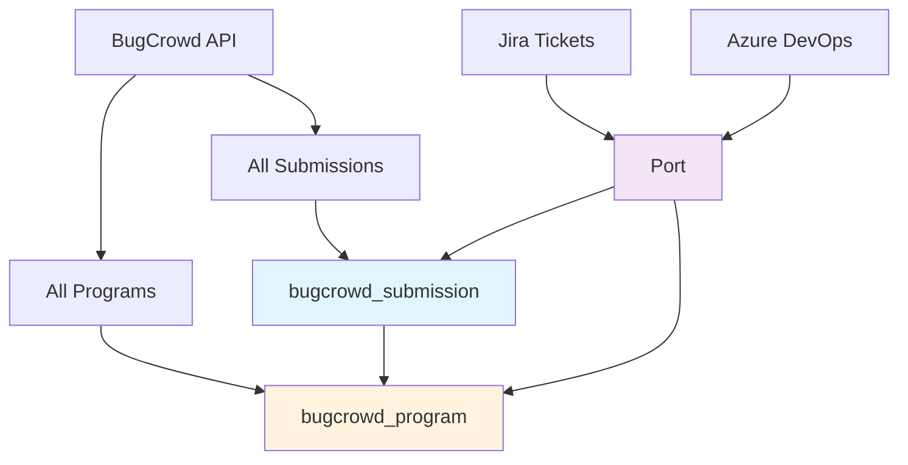

# BugCrowd Security Submissions Integration

This script ingests **security vulnerability submissions** from BugCrowd into Port, providing unified visibility of security issues alongside your Jira tickets and other development data.

---

## 📋 Prerequisites

Before running the script, ensure you have the following:

- ✅ **Port Client ID and Secret**  
  Required to authenticate with the Port API for ingesting submission data.  
  [Documentation](https://docs.getport.io)

- ✅ **BugCrowd API Token**  
  Used to access BugCrowd submissions API.  
  **How to get it**: Log into BugCrowd → Profile Picture → API Credentials → Create credentials  
  **Format**: `identifier:secret_key` (e.g., `abc123:xyz789secretkey`)  
  **Rate Limit**: 60 requests per minute per IP address  
  [BugCrowd API Documentation](https://docs.bugcrowd.com/api/getting-started)

- ✅ **BugCrowd Access**  
  Your API token must have access to the programs you want to sync (the script will fetch ALL accessible programs automatically)

---

## 🔧 Blueprints

### 🛡️ BugCrowd Program

```json
{
  "identifier": "bugcrowd_program",
  "title": "BugCrowd Program",
  "icon": "Shield",
  "schema": {
    "properties": {
      "description": {
        "type": "string",
        "title": "Description"
      },
      "state": {
        "type": "string",
        "title": "Program State",
        "enum": ["active", "paused", "inactive"]
      },
      "program_type": {
        "type": "string",
        "title": "Program Type"
      },
      "maximum_reward": {
        "type": "number",
        "title": "Maximum Reward"
      },
      "bugcrowd_url": {
        "type": "string",
        "format": "url",
        "title": "BugCrowd Program URL"
      }
    },
    "required": []
  },
  "relations": {}
}
```

### 🐛 BugCrowd Submission

```json
{
  "identifier": "bugcrowd_submission",
  "title": "BugCrowd Submission",
  "icon": "Bug",
  "schema": {
    "properties": {
      "description": {
        "type": "string",
        "title": "Description"
      },
      "severity": {
        "type": "string",
        "title": "Severity"
      },
      "status": {
        "type": "string",
        "title": "Status"
      },
      "submitted_at": {
        "type": "string",
        "format": "date-time",
        "title": "Submitted At"
      },
      "researcher_name": {
        "type": "string",
        "title": "Researcher"
      },
      "target": {
        "type": "string",
        "title": "Target Asset"
      },
      "bugcrowd_url": {
        "type": "string",
        "format": "url",
        "title": "BugCrowd URL"
      }
    },
    "required": []
  },
  "relations": {
    "program": {
      "title": "BugCrowd Program",
      "target": "bugcrowd_program",
      "required": true,
      "many": false
    }
  }
}
```

---

## 🚀 Running the Script

### 1. Update Credentials

Edit the script and update the following placeholders in the configuration section:

```python
BUGCROWD_API_TOKEN = "<YOUR_BUGCROWD_API_TOKEN>"  # Format: "identifier:secret_key" 

PORT_CLIENT_ID = "<YOUR_PORT_CLIENT_ID>"
PORT_CLIENT_SECRET = "<YOUR_PORT_CLIENT_SECRET>"
```

**Getting your BugCrowd API Token:**
1. Log into BugCrowd
2. Click your profile picture (top right) → "API Credentials"
3. Enter a descriptive name → "Create credentials"  
4. **Important**: Copy the token immediately - it won't be shown again!
5. The token format is `identifier:secret_key` (colon-separated)

---

### 2. Install Dependencies

```bash
pip install requests
```

---

### 3. Create Port Blueprints

Before running the script, create both blueprints in Port:

1. **Import Blueprints**  
   Go to your Port instance and import both `bugcrowd_program` and `bugcrowd_submission` blueprints from `blueprints.json`

2. **Verify Blueprints**  
   Ensure both blueprints appear in your Port catalog with the correct schema and relations

---

### 4. Run the Script

Once the credentials are set:

```bash
python main.py
```

This will:
- ✅ Authenticate with Port using OAuth client credentials
- ✅ **Fetch ALL BugCrowd programs** accessible with your API token
- ✅ Create program entities in Port with metadata and URLs
- ✅ **Fetch security submissions from ALL programs** (last 30 days by default)
- ✅ Transform BugCrowd data format to Port entities
- ✅ **Extract researcher and target names** from BugCrowd relationships
- ✅ Preserve BugCrowd severity (1-5) and status values directly
- ✅ **Link each submission to its program** for proper organization
- ✅ Handle pagination for both programs and submissions

---

## 🔄 Data Flow



---

## 🧠 Notes

- **Complete Program Coverage**: Fetches ALL accessible BugCrowd programs automatically
- **Hierarchical Organization**: Submissions are properly linked to their parent programs
- **Unified Security View**: See programs and submissions alongside Jira tickets and other development data
- **Native BugCrowd Values**: Uses BugCrowd's original severity (1-5) and status values directly
- **Name Resolution**: Extracts actual researcher usernames and target names from API relationships
- **Researcher Attribution**: Identifies which security researchers found issues
- **Clean Field Mapping**: Only includes fields available from BugCrowd API (removed created_at/updated_at for programs)
- **Program Metadata**: Tracks program state, type, and provides BugCrowd URLs
- Script uses `upsert=true` to avoid duplicates and update existing entities
- OAuth tokens are generated fresh on each run for security
- Handles BugCrowd API pagination for both programs and submissions

---

## 🔧 Customization

You can modify the following in the script:

- **Time Range**: Change `days_back=30` in the `get_all_bugcrowd_submissions()` call to adjust lookback period
- **Severity Filtering**: Add filters to focus on specific severity levels (1-5)
- **Status Filtering**: Add filters to focus on specific submission states (new, triaged, resolved, etc.)
- **Data Filtering**: Add custom filters based on researcher, target, or other criteria
- **API Version**: Update `Bugcrowd-Version` header to use different API versions

---

## 🎯 Use Cases

### Security Dashboard
- Track critical vulnerabilities across all your services
- Monitor researcher activity and submission trends
- Analyze vulnerability types and patterns

### Integration with Development Workflow  
- Cross-reference with Jira tickets for fix tracking
- Prioritize development work based on security severity
- Track researcher contributions and submission patterns

### Compliance & Reporting
- Generate security metrics and KPIs
- Track mean time to resolution for vulnerabilities
- Report on security posture improvements

---

For more information, visit [getport.io](https://www.getport.io) and [BugCrowd API Documentation](https://docs.bugcrowd.com/api/).
